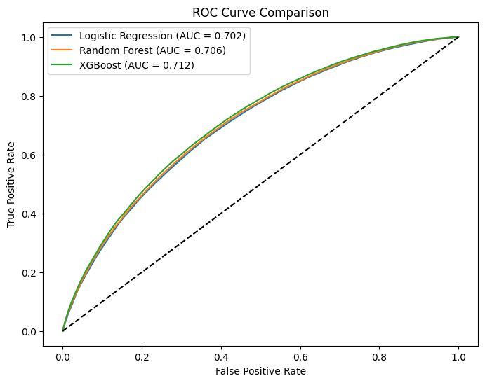
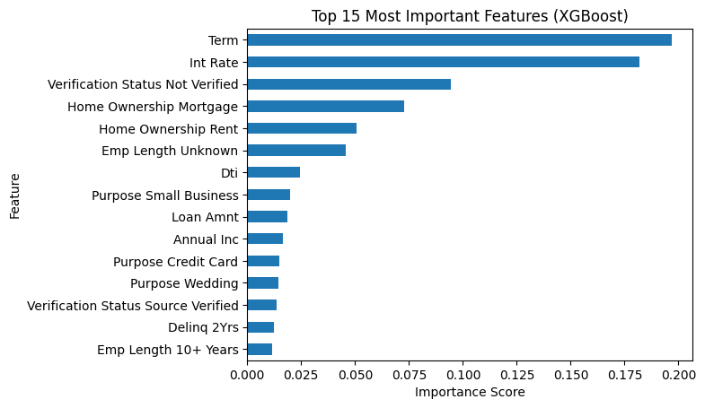

# Credit Risk Modeling and Default Prediction

## Overview

This project builds a machine learning pipeline to predict loan default risk using the Lending Club loan dataset. The goal is to develop models that can identify borrowers who are likely to default on their loans based on financial and credit-related features.

The project implements a full machine learning workflow including data preprocessing, feature engineering, model training, evaluation, and model interpretability.

Three models are evaluated:

- Logistic Regression
- Random Forest
- XGBoost

Performance is evaluated using ROC-AUC, precision, recall, and F1-score.

---

## Problem Statement

Financial institutions need to assess the risk associated with lending money to borrowers. Predicting the likelihood of loan default helps lenders reduce financial losses and make more informed lending decisions.

This project aims to build predictive models that classify whether a borrower is likely to default based on financial attributes and loan characteristics.

---

## Dataset

The dataset used in this project is the **Lending Club Loan Dataset**.

Source:  
https://www.kaggle.com/datasets/adarshsng/lending-club-loan-data-csv

The dataset contains borrower information including:

- Loan amount
- Interest rate
- Debt-to-income ratio
- Employment length
- Loan purpose
- Revolving credit utilization
- Verification status

The full dataset contains over **1.3 million loan records**.

Due to its large size, the dataset is not included in this repository. It can be downloaded from the Kaggle link above and placed in the `data/` directory.

Expected file structure:
data/
loan.csv
LCDataDictionary.xlsx

---

## Project Structure
credit-risk-ml-pipeline
│
├── data
│ └── loan.csv
│
├── notebooks
│ └── creditriskmodel.ipynb
│
├── src
│ ├── datapreprocessing.py
│ ├── featureengineering.py
│ └── modelpipeline.py
│
├── models
│ └── creditriskmodel.pkl
│
├── orchestrator.py
├── requirements.txt
└── README.md

---

## Methodology

The project follows a modular machine learning pipeline:

### 1. Data Preprocessing
- Cleaning loan status labels
- Handling missing values
- Feature selection
- Converting categorical variables

### 2. Feature Engineering
Key financial attributes were selected to represent borrower creditworthiness, including:

- Loan amount
- Interest rate
- Debt-to-income ratio
- Revolving credit utilization
- Employment length
- Loan purpose

Categorical variables were encoded using **OneHotEncoder**, while numerical features were standardized using **StandardScaler**.

### 3. Model Pipeline

A Scikit-learn pipeline was implemented to ensure consistent preprocessing and model training.

Pipeline components:

- ColumnTransformer
- StandardScaler
- OneHotEncoder
- Classifier

---

## Models Implemented

Three classification models were evaluated:

### Logistic Regression
Used as a baseline model due to its interpretability and computational efficiency.

### Random Forest
An ensemble tree-based model capable of capturing nonlinear relationships in the data.

### XGBoost
A gradient boosting algorithm known for strong predictive performance on structured datasets.

Class imbalance was handled using `scale_pos_weight` to improve default detection.

---

## Results

Model performance was evaluated using ROC-AUC.

| Model | ROC-AUC |
|------|------|
| Logistic Regression | 0.702 |
| Random Forest | 0.706 |
| XGBoost | 0.712 |

While XGBoost achieved the highest ROC-AUC, Logistic Regression remained competitive while offering greater interpretability and faster training time.

---

## Model Interpretability

To understand the model's decision-making process, feature importance and SHAP analysis were performed.

### Feature Importance

Top features influencing default prediction include:

- Interest rate
- Debt-to-income ratio
- Loan amount
- Revolving credit utilization

### SHAP Analysis

SHAP (SHapley Additive Explanations) was used to analyze feature contributions to model predictions.

This allows us to understand how individual features influence the likelihood of default.

---

## Visualizations

### ROC Curve Comparison

### Feature Importance

### SHAP Summary Plot

---

## How to Run the Project

### 1. Clone the repository
git clone https://github.com/AasthaK24/credit-risk-pred-pipeline.git

### 2. Install dependencies
pip install -r requirements.txt

### 3. Place dataset

Download the Lending Club dataset from Kaggle and place it in:
data/

### 4. Run preprocessing pipeline
python orchestrator.py

### 5. Run the notebook

Open and run:
notebooks/creditrisk.ipynb

---

## Future Improvements

Potential improvements for the project include:

- Hyperparameter tuning using grid search
- Feature selection optimization
- KS-statistic evaluation (commonly used in credit risk modeling)
- Model calibration
- Deployment as a prediction API

---

## Author

Aastha Kumar  
GitHub: https://github.com/AasthaK24
